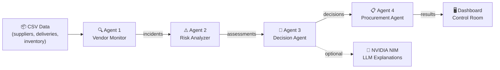

<p align="center">
  <h1 align="center">◈ VendorGuard AI</h1>
  <p align="center">
    <b>Autonomous Procurement Risk Control Room</b><br>
    <i>Monitor → Assess → Decide → Act</i>
  </p>
</p>

<p align="center">
  
  
  
  
  
</p>

---

## 📖 Overview

**VendorGuard AI** is a multi-agent, AI-powered supply-chain risk management system that autonomously detects vendor anomalies, assesses business impact, makes procurement decisions, and executes corrective actions — all in a single pipeline run.

It features a **Streamlit-based control room dashboard** that visualises the full agent reasoning chain, supplier risk cards, cost-impact charts, and a live procurement queue.

---

## 📑 Table of Contents

- [Overview](#-overview)
- [Architecture](#️-architecture)
- [Project Structure](#-project-structure)
- [Getting Started](#-getting-started)
- [Dashboard Features](#️-dashboard-features)
- [Data Schema](#-data-schema)
- [Configuration & Tuning](#️-configuration--tuning)
- [How the Pipeline Works](#-how-the-pipeline-works)
- [Security Notes](#️-security-notes)
- [Contributing](#-contributing)
- [License](#-license)

---

## 🏗️ Architecture

The system is built as a **4-agent sequential pipeline**, where each agent consumes the output of the previous one:

```
┌─────────────────────┐     ┌─────────────────────┐     ┌─────────────────────┐     ┌─────────────────────┐
│   Agent 1            │     │   Agent 2            │     │   Agent 3            │     │   Agent 4            │
│   Vendor Monitor     │────▶│   Risk Analyzer      │────▶│   Decision Agent     │────▶│   Procurement Agent  │
│                      │     │                      │     │                      │     │                      │
│  • Late deliveries   │     │  • Time-to-stockout  │     │  • Backup supplier   │     │  • Purchase requests │
│  • Quality drops     │     │  • ₹ business impact │     │  • Action routing    │     │  • Warehouse alerts  │
│  • Price spikes      │     │  • Severity scoring  │     │  • LLM explanations  │     │  • Approval summaries│
└─────────────────────┘     └─────────────────────┘     └─────────────────────┘     └─────────────────────┘
```

### Agent Details

| Agent | File | Role | Key Logic |
|-------|------|------|-----------|
| **1 — Vendor Monitor** | `agent1_vendor_monitor.py` | Detect anomalies in supplier data | Rule-based checks: quality < 85%, on-time < 90%, price index > 1.08, delivery delays ≥ 3 days |
| **2 — Risk Analyzer** | `agent2_risk_analyzer.py` | Assess business impact of incidents | Cross-references inventory levels, computes time-to-stockout (hours), estimates ₹ impact, assigns HIGH/MEDIUM/LOW severity |
| **3 — Decision Agent** | `agent3_decision_agent.py` | Decide corrective action | HIGH → emergency procurement + backup supplier; MEDIUM → flag for review; LOW → monitor only. Optionally generates LLM-powered natural-language explanations via NVIDIA NIM |
| **4 — Procurement Agent** | `agent4_procurement_agent.py` | Execute simulated procurement | Creates purchase requests, sends warehouse alerts, builds approval summaries, persists to `procurement_queue.json` |

---

## 📂 Project Structure

```
VENDOR/
├── main.py                    # Orchestrator — runs the full 4-agent pipeline (CLI)
├── dashboard.py               # Streamlit control room UI
├── data_loader.py             # Shared CSV loading & parsing utility
├── llm_client.py              # NVIDIA NIM (OpenAI-compatible) LLM wrapper
│
├── agent1_vendor_monitor.py   # Agent 1 — anomaly detection
├── agent2_risk_analyzer.py    # Agent 2 — risk & impact assessment
├── agent3_decision_agent.py   # Agent 3 — decision routing + LLM explanations
├── agent4_procurement_agent.py# Agent 4 — procurement execution
│
├── suppliers.csv              # Supplier master data (quality, on-time rate, price index)
├── deliveries.csv             # Delivery tracking (expected vs actual dates)
├── inventory.csv              # Current stock levels, safety stock, daily usage
├── purchase_orders.csv        # Historical purchase orders
├── procurement_queue.json     # Simulated procurement queue (auto-generated)
│
├── env.example                # Template for environment variables
├── requirements.txt           # Python dependencies
└── README.md                  # ← You are here
```

---

## 🚀 Getting Started

### Prerequisites

- **Python 3.10+**
- (Optional) **NVIDIA NIM API key** — for LLM-generated explanations in Agent 3. The pipeline works fully without it using rule-based fallbacks.

### 1. Clone the repository

```bash
git clone <your-repo-url>
cd VENDOR
```

### 2. Setup Virtual Environment & Install Dependencies

It is highly recommended to use a Python virtual environment to keep dependencies isolated:

```bash
# Create a virtual environment
python -m venv venv

# Activate the virtual environment
# On macOS/Linux:
source venv/bin/activate
# On Windows:
venv\Scripts\activate

# Install the required packages
pip install -r requirements.txt
```

This installs:
| Package | Purpose |
|---------|---------|
| `streamlit ≥ 1.32` | Dashboard frontend |
| `plotly ≥ 5.18` | Interactive charts |
| `openai ≥ 1.30` | NVIDIA NIM API client (OpenAI-compatible SDK) |

### 3. Configure environment (optional)

Copy the example env file and add your NVIDIA NIM API key:

```bash
cp env.example .env
```

Edit `.env`:
```
NVIDIA_API_KEY="your-nvidia-nim-api-key"
```

> **Note:** Get a free key from [https://build.nvidia.com](https://build.nvidia.com). If no key is set, the system gracefully falls back to rule-based explanations — no crash, no error.

### 4. Run the pipeline

**Option A — Command-line pipeline:**
```bash
python main.py
```

**Option B — Interactive dashboard:**
```bash
streamlit run dashboard.py
```

---

## 🖥️ Dashboard Features

The Streamlit control room provides:

| Section | Description |
|---------|-------------|
| **Status Pills** | Live counts of tracked suppliers, HIGH/MEDIUM/LOW risks, generated PRs |
| **Vendor Overview Cards** | Per-supplier cards showing quality score, on-time rate, max delay, and severity badge |
| **Agent Reasoning Chain** | Step-by-step visual flow of how each incident was assessed — from raw metrics to final decision |
| **Estimated Exposure Chart** | Horizontal bar chart (Plotly) showing ₹ impact per flagged supplier |
| **Procurement Queue** | Table of all generated purchase requests with status, backup supplier, and estimated impact |

---

## 📊 Data Schema

### `suppliers.csv`
| Column | Type | Description |
|--------|------|-------------|
| `supplier_id` | string | Unique supplier identifier (e.g., S001) |
| `name` | string | Supplier display name |
| `quality_score` | float | Quality rating (0–100%) |
| `on_time_rate` | float | On-time delivery rate (0–100%) |
| `avg_delivery_days` | float | Average delivery lead time |
| `price_index` | float | Price relative to baseline (1.0 = baseline) |

### `deliveries.csv`
| Column | Type | Description |
|--------|------|-------------|
| `order_id` | string | Purchase order ID |
| `supplier` | string | Supplier ID (FK to suppliers) |
| `expected_date` | date | Promised delivery date |
| `actual_date` | date | Actual delivery date (empty if pending) |
| `status` | string | DELIVERED or PENDING |

### `inventory.csv`
| Column | Type | Description |
|--------|------|-------------|
| `product` | string | Product name |
| `supplier` | string | Supplier ID (FK to suppliers) |
| `current_stock` | int | Units currently in stock |
| `safety_stock` | int | Minimum safe stock level |
| `daily_usage` | int | Units consumed per day |

### `purchase_orders.csv`
| Column | Type | Description |
|--------|------|-------------|
| `order_id` | string | Order identifier |
| `supplier` | string | Supplier ID |
| `quantity` | int | Units ordered |
| `amount` | float | Order value (₹) |
| `order_date` | date | Date the order was placed |

---

## ⚙️ Configuration & Tuning

### Agent 1 — Detection Thresholds

Located in `agent1_vendor_monitor.py`:

```python
QUALITY_THRESHOLD   = 85.0   # Below this → quality risk flag
ON_TIME_THRESHOLD   = 90.0   # Below this → reliability risk flag
DELAY_DAYS_THRESHOLD = 3     # Days late → delivery incident
PRICE_INDEX_THRESHOLD = 1.08 # Above this → rising cost risk
```

### Agent 2 — Impact Estimation

Located in `agent2_risk_analyzer.py`:

```python
IMPACT_PER_UNIT_SHORTFALL = 1050  # ₹ per unit of unmet daily demand
```

### Agent 3 — Backup Supplier Criteria & LLM Toggle

Located in `agent3_decision_agent.py`:

```python
BACKUP_QUALITY_MIN  = 85.0   # Min quality to qualify as backup
BACKUP_ON_TIME_MIN  = 90.0   # Min on-time rate to qualify as backup
USE_LLM_EXPLANATION = True   # Set False to disable LLM calls entirely
```

### LLM Configuration

Located in `llm_client.py`:

```python
DEFAULT_MODEL    = "meta/llama-3.1-8b-instruct"
DEFAULT_BASE_URL = "https://integrate.api.nvidia.com/v1"
```

---

## 🔄 How the Pipeline Works



1. **Agent 1** scans `suppliers.csv` and `deliveries.csv` for anomalies (late deliveries, low quality scores, price spikes).
2. **Agent 2** cross-references incidents with `inventory.csv` to calculate time-to-stockout (hours), whether stock is below safety levels, and estimated ₹ business impact.
3. **Agent 3** applies decision rules (HIGH → emergency procurement, MEDIUM → flag for review, LOW → monitor only), finds the best backup supplier using a composite score, and optionally calls the LLM for natural-language explanations.
4. **Agent 4** creates simulated purchase requests, sends warehouse notifications, generates approval summaries, and persists the procurement queue to `procurement_queue.json`.

---

## 🛡️ Security Notes

- **API keys** are read from environment variables — never hardcoded in source.
- The `env.example` file is a template only; **never commit `.env` with real keys**.
- If the LLM API is unavailable (no key, no network, rate limited), the pipeline **does not crash** — it silently falls back to rule-based explanations.

---

## 🤝 Contributing

1. Fork the repository
2. Create a feature branch (`git checkout -b feature/my-feature`)
3. Commit your changes (`git commit -m "Add my feature"`)
4. Push to the branch (`git push origin feature/my-feature`)
5. Open a Pull Request

---

## 📄 License

This project is provided as-is for educational and demonstration purposes.

---

<p align="center">
  <b>VendorGuard AI</b> · Multi-Agent Procurement Risk Pipeline · Built with 🐍 Python, 🤖 NVIDIA NIM, and 📊 Streamlit
</p>
